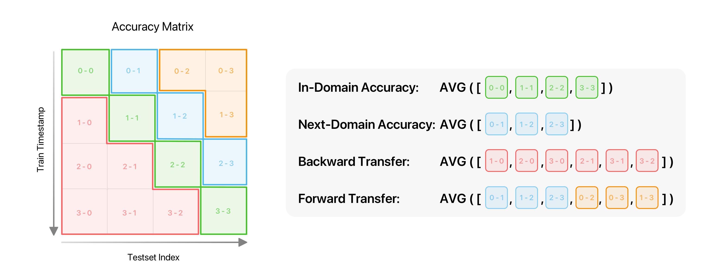

# [CLEAR](https://www.aicrowd.com/challenges/cvpr-2022-clear-challenge/) | Starter Kit 
[](https://discord.gg/fNRrSvZkry) [](https://join.slack.com/t/cvprclear/shared_invite/zt-17iae3bwh-YNMOVW4g1mzRNMtRSfdBTA)

This repository is the CLEAR Challenge **Submission template and Starter kit** for [CVPR 2022 Workshop on Visual Perception and Learning in an Open World](https://www.cs.cmu.edu/~shuk/vplow.html)! Clone the repository to compete now!

**This repository contains**:
*  **Starter code** for you to get started!
*  **Documentation** on how to submit your models to the AICrowd leaderboard.
*  **The procedure** for best practices and information on how we evaluate your models, etc.

# Table of Contents

1. [Competition Procedure](#competition-procedure)
2. [How to set up the environment/dataset](#how-to-set-up-the-environmentdataset)
3. [Evaluation Metrics](#evaluation-metrics)
4. [What to provide for the evaluation](#what-to-provide-for-the-evaluation)
4. [How do I specify my software runtime / dependencies?](#how-do-i-specify-my-software-runtime-dependencies-)
5. [What should my code structure be like ?](#what-should-my-code-structure-be-like-)
6. [How to make submission](#how-to-make-a-submission)
7. [Important links](#-important-links)


#  Competition Procedure

[Continual LEArning on Real-World Imagery (CLEAR)](https://clear-benchmark.github.io/) is the first continual image classification benchmark dataset with a natural temporal evolution of visual concepts in the real world that spans a decade (2004-2014). This competition will be an opportunity for researchers and machine learning enthusiasts to experiment and explore state-of-the-art Continual and Lifelong Learning algorithms on this novel benchmark based on the [NeurIPS 2021 paper](https://arxiv.org/abs/2201.06289).

The competition will be hosted on two datasets:
- **CLEAR-10**: The dataset introduced in [NeurIPS 2021 paper](https://arxiv.org/abs/2201.06289) with 10 buckets of training images from 11 classes.
- **CLEAR-100**: A new version of CLEAR that consists of more classes (100!) with 10 buckets spanning 2004-2014 (Coming soon in a week..)

The challenge consists of two stages: 
- **Stage 1**  

Participants train their models locally using the released CLEAR dataset consisting of 10 trainsets. The 10 trainsets will arrive sequentially, and in contrast to prior continual learning benchmarks, we do not pose an artificial constraint on the buffer size, which means you could use all images prior to the current timestamp to train your model (i.e., cumulative training). <mark>**However, we do limit the maximum training time allowed for each timestamp (12 hours on a single GTX1080TI).**</mark> The training time on different GPUs can be approximated using this [chart](https://mtli.github.io/gpubench/), so you may use other types of GPUs to develop your solution. Participants upload their models (10 in total, each is a model checkpoint saved after training on each timestamp) along with their training and evaluation scripts to AICrowd. The 10 submitted models will be evaluated against our private hold-out testsets. We have 10 hold-out testsets for both CLEAR10 and CLEAR100 collected on YFCC100M on the same time periods; therefore, each submission will get an 10x10 accuracy matrix. The evaluation metrics are 4 different summarization of the accuracy matrix, i.e. In-Domain Accuracy (mean of diagonal), Next-Domain Accuracy (mean of superdiagonal), Forward Transfer (mean of upper triangular entries), Backward Transfer (mean of lower triangular entries). Details about these metrics can be found in later section. We take an weighted average of the 4 metrics when determining the rankings in the leaderboard.

_The following is a high level description of how this process works_


1. **Sign up** to join the competition [on the AIcrowd website](https://www.aicrowd.com/challenges/cvpr-2022-clear-challenge/).
2. **Clone** this repo and start developing your solution.
3. **Train and save** your models using [starter_code.py](starter_code.py) as the initial template (purely PyTorch-based), or refer to our [Avalanche-based training script](https://github.com/ContinualAI/avalanche/blob/master/examples/clear.py).
4. **Evaluate** your models with your own predictor code as described in [how to write your own predictor](#how-to-write-your-own-predictor) section.
4. [**Submit**](#how-to-submit-a-model) your trained models as well as evaluation script to [AIcrowd Gitlab](https://gitlab.aicrowd.com) for evaluation [(full instructions below)](#how-to-submit-a-model). The automated evaluation setup will evaluate the submissions against our private testsets to compute and report the metrics on the leaderboard of the competition.

- **Stage 2**  

The top 5 teams on the public leaderboard in Stage 1 will be asked to provide a dockerized environment to train their models on our own servers. We will validate each team's models submitted to the leaderboard by training their models within the specified time limit, comparing the accuracy with the baselines, as well as verifying that they did not use auxilary information to train the model (e.g., pre-trained network, additional labeled data, and etc.). Teams with invalid submissions will be removed from the leaderboard, and remaining top-4 teams with valid submissions will be eligible for the awards.

# How to set up the environment/dataset
We have partnered up with the most popular open-sourced continual learning library [Avalanche](https://avalanche.continualai.org). The starter code for this competition (including data downloading and training) will be based on [Avalanche](https://avalanche.continualai.org), though we also provided a template ([starter_code.py](starter_code.py)) based purely on PyTorch so you don't need to [learn Avalanche](https://avalanche.continualai.org/getting-started/learn-avalanche-in-5-minutes) if you have no prior experience working with it.

To set up the environment, you will need [Ananconda](https://www.anaconda.com) installed on your system. Then you may follow the following steps:

1. **Add your SSH key** to AIcrowd GitLab

You can add your SSH Keys to your GitLab account by going to your profile settings [here](https://gitlab.aicrowd.com/profile/keys). If you do not have SSH Keys, you will first need to [generate one](https://docs.gitlab.com/ee/ssh/README.html#generating-a-new-ssh-key-pair).

2.  **Clone the repository**
    ```
    git clone git@gitlab.aicrowd.com:Geniussh/clear-starter-kit.git
    cd clear-starter-kit
    ```

3. **Create** a virtual conda environment
    ```
    conda create -n clear_2022 python=3.8 -c conda-forge
    conda activate clear_2022
    ```

4. **Install** AIcrowd competition specific dependencies via:
    ```
    pip install aicrowd-cli
    ```

5. **Install** the most recent PyTorch version from their [official website](https://pytorch.org/get-started/). Make sure to specify a CUDA version for GPU usage. For example:
    ```
    conda install pytorch torchvision torchaudio cudatoolkit=11.3 -c pytorch
    ```

6. **Clone** the master branch of [Avalanche](https://avalanche.continualai.org) and update conda env via:
    ```
    git clone https://github.com/ContinualAI/avalanche.git
    conda env update --file avalanche/environment.yml
    ```

7. **Modify** [config.py](./config.py) with respect to the task you are submitting to. Change ```AVALANCHE_PATH``` to your local path to avalanche library. ```DATASET_NAME``` is to specify which dataset you will use to train and test your models, either ```clear10``` or ```clear100_cvpr2022```. ```ROOT``` will be the local path to save the corresponding dataset. 

8. Start training the baseline models via running:
    ```
    python starter_code.py
    ```

9. Write the helper functions for your own predictor (including test-time data augmentation and model loading functions) as described in [what to provide for the evaluation](#what-to-provide-for-the-evaluation) section.

10. Make a submission as described in [how to make a submission](#how-to-make-a-submission) section. **IMPORTANT** Remember to change the ```task``` field to the subtask you are submitting to, either ```clear10``` or ```clear100```. 


<!-- # How to access and use the CLEAR dataset
We have made CLEAR public on [Avalanche](https://avalanche.continualai.org). If you have used Avalanche for your other projects, then it is very easy to get started! Just pull the most recent commit from their official [repo](https://github.com/ContinualAI/avalanche), and check out [this example on how to train on CLEAR](https://github.com/ContinualAI/avalanche/blob/master/examples/clear.py). If you haven't used Avalanche before, you could use the [starter code](starter_code.py) provided to download CLEAR dataset from Avalanche, and perform training and evaluation in PyTorch only (so you don't need to know anything about Avalanche).  -->

<mark>**[IMPORTANT] You are not allowed to pre-train your models on any data. The models have to be learned from scratch. For example, in ```starter_code.py``` the models are trained from scratch on the ResNet-18 architecture.**</mark>


# Evaluation Metrics

The submitted model will be evaluated against the private testsets to obtain an 10x10 accuracy matrix (we provide a 4x4 accuracy matrix above to visually illustrate how we calculate the metrics). The y-axis is the training timestamp and x-axis is the index of test bucket.

The leaderboard will consists of the above 4 metrics. In-Domain and Next-Domain accuracy are proposed in the [CLEAR paper](https://arxiv.org/abs/2201.06289) for measuring the test performance within the same time period or the next immediate time period. Backward Transfer and Forward Transfer are defined similarly to prior works on continual learning.


# What to provide for the evaluation

We require that you place your 10 trained models in `models` directory and use the interface defined in `evaluation_setup.py`. In `evaluation_setup.py`, you need to explicitly provide the two following functions so that we can evaluate your models and auto-generated your scores on our end. 
- `load_models(models_path)` takes in the path to the 10 trained models, i.e. `models/`, and it should return a list of loaded models. How you load each of them is up to you and should be consistent with how you saved your models. For example, if you saved your models as its parameter dictionary, then you want to use `torch.nn.Module.load_state_dict`; otherwise if you saved the entire model, you want to use `torch.save` directly. [Note that if you trained your models using `torch.nn.DataParallel`, there will be `module.` inserted at the beginning of each key of your saved state_dict, in which case loading the state_dict onto a model from `torchvision.models` will fail. Therefore, you need to remove the `module.` key when implementing this function, as already shown in the [example](evaluation_setup.py).
- `data_transform()` describes the data transform you used to test your 10 models, which should be consistent with the data transform used against your training data to train your 10 models initially. Only with this can we transform the held-out test data accordingly and evaluate your models. 

Finally one step before you can actually submit your great work! To validate your `evaluation_setup.py` as well as your models, run `python local_evaluation.py` by passing in the path to the dataset, which should direct to your downloaded dataset from Avalanche, i.e. `<config.ROOT>/<config.DATASET_NAME>/labeled_images`. 
```
python local_evaluation.py --dataset-path <config.ROOT>/<config.DATASET_NAME>/labeled_images
```
It would print a weighted average score, which will be used for your ranking on the leaderboard, four scores corresponding to the four metrics as described above, and a visualization of the accuracy matrix in `accuracy_matrix.png`. 


# How do I specify my software runtime / dependencies ?

We accept submissions with custom runtime, so you don't need to worry about which libraries or framework to pick from.

The configuration files typically include `requirements.txt` (pypi packages), `environment.yml` (conda environment), `apt.txt` (apt packages) or even your own `Dockerfile`. You can check detailed information about the same in the 👉 [RUNTIME.md](docs/runtime.md) file.

Remember to put all extra dependencies you have used in `evaluation_setup.py` into your configuration file (in this template it's `requirements.txt`).

# What should my code structure be like ?

Please follow the example structure as it is in the starter kit for the code structure.
The different files and directories have following meaning:

```
.
├── aicrowd.json           # Submission meta information - like your username
├── evaluation_utils/      # Directory containing helper scripts for evaluation (DO NOT EDIT)
├── requirements.txt       # Python packages to be installed
├── local_evaluation.py    # Helper script for local evaluations
└── evaluation_setup.py    # IMPORTANT: Add your data transform and model loading functions that are consistent with your trained models
└── starter_code.py        # Example model training script using Avalanche on CLEAR benchmark
└── config.py              # Configuration file for Avalanche library
└── submit.sh              # Helper script for submission
```

Finally, **you must specify an AIcrowd submission JSON in `aicrowd.json` to be scored!** 

The `aicrowd.json` of each submission should contain the following content:

```json
{
  "challenge_id": "clear-2022",
  "task": "clear10", 
  "authors": [
    "your-aicrowd-username"
  ],
  "description": "(optional) description about your awesome agent",
  "gpu": true
}
```

This JSON is used to map your submission to the challenge - so please remember to use the correct `challenge_id` and the correct `task` you wish to submit your code to, as specified above.

Also, make sure the ```gpu``` flag is true so we can speed up the evaluation. 

# How to make a submission?

We have added a quick submission utility script as part of this starter kit, to keep things simple. You can make submission as follows:

```
./submit.sh <unique-submission-name>

Example: ./submit.sh "bayes v0.1"
```

In case you don't want to use this utility script, please check out the submission guidelines [SUBMISSION.md](docs/SUBMISSION.md).

<mark>**[IMPORTANT] You must provide a brief explanation or discussion about your submission in the auto-generated GitLab issue after it's successfully evaluated.**</mark>

**Best of Luck** :tada: :tada:

## Contributing

🙏 You can share your solutions or any other baselines by contributing directly to this repository by opening merge request.

- Add your implementation.
- Test it out using `python local_evaluation.py`.
- Add any documentation for your approach at top of your file.
- Create merge request! 🎉🎉🎉 

## Contributors

- Shihao Shen
- Zhiqiu Lin
- Jia Shi
- Siqi Zeng

# 📎 Important links


💪 &nbsp;Challenge Page: https://www.aicrowd.com/challenges/cvpr-2022-clear-challenge

🗣️ &nbsp;Discussion Forum: https://www.aicrowd.com/challenges/cvpr-2022-clear-challenge/discussion

🏆 &nbsp;Leaderboard: https://www.aicrowd.com/challenges/cvpr-2022-clear-challenge/leaderboards
